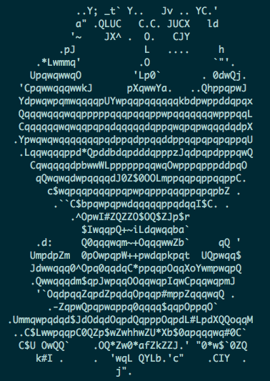
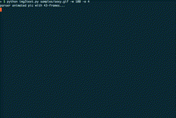
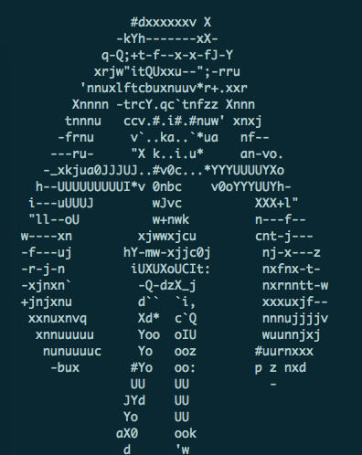

```
                                **           **                                                
                               /**          /**                                                
           *****   ******      /**  *****   /**       ******   *******  *******   *****  ******
          **///** **////**  ****** **///**  /******  //////** //**///**//**///** **///**//**//*
         /**  // /**   /** **///**/*******  /**///**  *******  /**  /** /**  /**/******* /** / 
         /**   **/**   /**/**  /**/**////   /**  /** **////**  /**  /** /**  /**/**////  /**   
         //***** //****** //******//******  /****** //******** ***  /** ***  /**//******/***   
          /////   //////   //////  //////   /////    //////// ///   // ///   //  ////// ///    
```

[TOC]

# code_banner
一个有追求的程序员总是希望自己的项目有一个高端大气上档气的banner，但是每次开发项目都去设计banner无疑有点浪费时间。
因此，这个项目总结一些程序员常用banner生成方法，以及一些著名的banner图案，方便在使用的时候可以信手拈来。
源码地址：https://github.com/HeLiangHIT/code_banner

## 文字banner生成
### 网页版
1. 打开网页： http://www.network-science.de/ascii/
2. 输入文字比如`code banner`，选择字体比如graffiti，点击do it! 等待几秒。
3. 输出内容后拷贝：
```
                 .___       ___.                                      
  ____  ____   __| _/____   \_ |__ _____    ____   ____   ___________ 
_/ ___\/  _ \ / __ |/ __ \   | __ \\__  \  /    \ /    \_/ __ \_  __ \
\  \__(  <_> ) /_/ \  ___/   | \_\ \/ __ \|   |  \   |  \  ___/|  | \/
 \___  >____/\____ |\___  >  |___  (____  /___|  /___|  /\___  >__|   
     \/           \/    \/       \/     \/     \/     \/     \/       

```

### 本地安装
网页版有时候太慢了，该工具开源，可以下载到本地编译安装。依次执行如下命令安装工具：
```shell
wget ftp://ftp.figlet.org/pub/figlet/program/unix/figlet-2.2.5.tar.gz
tar -zxvf figlet-2.2.5.tar.gz
cd figlet-2.2.5
make && make install
```
> 该工具已解压到目录 [./figlet/](./figlet/) 下，可以直接在里面编译安装。

之后可以执行 `figlet "code banner"` 生成对应的banner如下
```
               _        _
  ___ ___   __| | ___  | |__   __ _ _ __  _ __   ___ _ __
 / __/ _ \ / _` |/ _ \ | '_ \ / _` | '_ \| '_ \ / _ \ '__|
| (_| (_) | (_| |  __/ | |_) | (_| | | | | | | |  __/ |
 \___\___/ \__,_|\___| |_.__/ \__,_|_| |_|_| |_|\___|_|
```

更多控制参数[查看帮助](http://www.figlet.org/)：
```
Usage: figlet [ -cklnoprstvxDELNRSWX ] [ -d fontdirectory ]
              [ -f fontfile ] [ -m smushmode ] [ -w outputwidth ]
              [ -C controlfile ] [ -I infocode ] [ message ]
```
其中字体可以到 http://www.figlet.org/examples.html 选择，然后到 http://www.figlet.org/fontdb.cgi 下载后用于生成对应风格的banner文字。项目font目录下是我觉得还不错的一些字体。

指定字体生成banner的方法：`figlet -d ./font -f alligator.flf -w 120 'code banner'`
```
      ::::::::  :::::::: ::::::::: ::::::::::        :::::::::     :::    ::::    :::::::    ::::::::::::::::::::::
    :+:    :+::+:    :+::+:    :+::+:               :+:    :+:  :+: :+:  :+:+:   :+::+:+:   :+::+:       :+:    :+:
   +:+       +:+    +:++:+    +:++:+               +:+    +:+ +:+   +:+ :+:+:+  +:+:+:+:+  +:++:+       +:+    +:+
  +#+       +#+    +:++#+    +:++#++:++#          +#++:++#+ +#++:++#++:+#+ +:+ +#++#+ +:+ +#++#++:++#  +#++:++#:
 +#+       +#+    +#++#+    +#++#+               +#+    +#++#+     +#++#+  +#+#+#+#+  +#+#+#+#+       +#+    +#+
#+#    #+##+#    #+##+#    #+##+#               #+#    #+##+#     #+##+#   #+#+##+#   #+#+##+#       #+#    #+#
########  ######## ######### ##########        ######### ###     ######    #######    #################    ###
```
> 这里整理一些比较合适的字体： block.flf, bulbhead.flf, computer.flf, alligator.flf, doh.flf, isometric1.flf, isometric2.flf, isometric3.flf, isometric4.flf, larry3d.flf, lean.flf, nancyj-fancy.flf, ogre.flf, pebbles.flf, puffy.flf, roman.flf, small.flf, smkeyboard.flf, tinker-toy.flf, univers.flf

> 另外还有其他一些类似的工具都可以直接安装，例如： `brew install sysvbanner toilet figlet`


## 图片banner生成
关于图像banner的生成方式，看了一些现有的发现都需要修改后才能用，不能拿来即用就是不方便！

所以只能自己写了一个脚本来实现了，参考：[./img2txt/img2text.py](./img2txt/img2text.py). 基本原理就是读取图像将每个像素值转换为灰度，然后映射到不同密度的字符，然后打印字符。

使用方法：`python img2text.py -h`
```
usage: img2text.py [OPTIONS] [file...]
生成banner
Arguments:
  file...                banner image file
Options:
  -o, --out-file=STR     output txt file name, append by 0-n for sequence
  -w, --out-width=INT    output text width (unit: char) (default: 100)
  -l, --out-height=INT   output text height (unit: line) (default: 0)
  -e, --enhance=FLOAT    image enhance factor, now try yourself diff value to get a better out (default: 1.0)
Other actions:
  -h, --help             Show the help
```

举例说明：

1 生产LOGO对应的字符banner： `python img2text.py samples/frog.jpg -w 100 -o out.txt`
  

<!-- 2. 还可以支持动画哦：`python img2text.py samples/sexy.gif -w 100 -e 4`



> 百度随便找了一张动态图，貌似有点不正经。 -->

2 还可以支持动画哦：`python img2text.py samples/chuyin.gif -w 100 -e 1.2`
   


### TODO
+ 当前字符映射逻辑还不太合理，有待优化。
+ 项目中的图像对比度调节还没有做到自动化，有待优化。

## 其他精心设计的banner
### 女神
```py
banner = """
.================================================================.
||                            title                             ||
||       " << g_softname << " v" << g_version << "              ||
|'--------------------------------------------------------------'|
||                                         -- main instructions ||
|'=============================================================='|
||                                .::::.                        ||
||                              .::::::::.                      ||
||                              :::::::::::                     ||
||                              ':::::::::::..                  ||
||                              .:::::::::::::::'               ||
||                                '::::::::::::::.`             ||
||                                  .::::::::::::::::.'         ||
||                                .::::::::::::..               ||
||                              .::::::::::::::''               ||
||                   .:::.       '::::::::''::::                ||
||                 .::::::::.      ':::::'  '::::               ||
||                .::::':::::::.    :::::    '::::.             ||
||              .:::::' ':::::::::. :::::.     ':::.            ||
||            .:::::'     ':::::::::.::::::.      '::.          ||
||          .::::''         ':::::::::::::::'       '::.        ||
||         .::''              '::::::::::::::'        ::..      ||
||      ..::::                  ':::::::::::'         :'''`     ||
||   ..''''':'                    '::::::.'                     ||
|'=============================================================='|
||                                       helianghit@foxmail.com ||
||                                https://github.com/HeLiangHIT ||
'================================================================'
"""
print(banner)

# 动态打印banner
def animate_banner(tick=0.001):
    import time
    for c in banner:
        time.sleep(tick)
        print(c, end="")
```

### 佛主
```py
banner = """
                       _ooOoo_                        
                      o8888888o                       
                      88" . "88                       
                      (| ^_^ |)                       
                      O\  =  /O                       
                   ____/`---'\____                    
                 .'  \\|     |//  `.                  
                /  \\|||  :  |||//  \                 
               /  _||||| -:- |||||-  \                
               |   | \\\  -  /// |   |                
               | \_|  ''\---/''  |   |                
               \  .-\__  `-`  ___/-. /                
             ___`. .'  /--.--\  `. . ___              
           ."" '<  `.___\_<|>_/___.'  >'"".           
         | | :  `- \`.;`\ _ /`;.`/ - ` : | |          
         \  \ `-.   \_ __\ /__ _/   .-` /  /          
   ========`-.____`-.___\_____/___.-`____.-'========  
                        `=---='                       
   ^^^^^^^^^^^^^^^^^^^^^^^^^^^^^^^^^^^^^^^^^^^^^^^^^
           佛祖保佑       永不宕机     永无BUG           
"""
print(banner)

# 动态打印banner
def animate_banner(tick=0.001):
    import time
    for c in banner:
        time.sleep(tick)
        print(c, end="")
```


欢迎扫码关注作者，获取更多信息哦～另外如果本源码对你有所帮助，可以[点赞以支持作者的持续更新哦](./URgood.jpg)。


